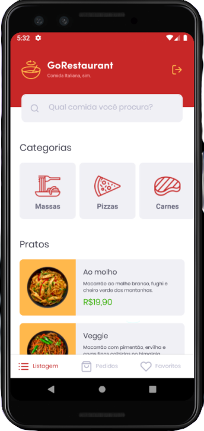
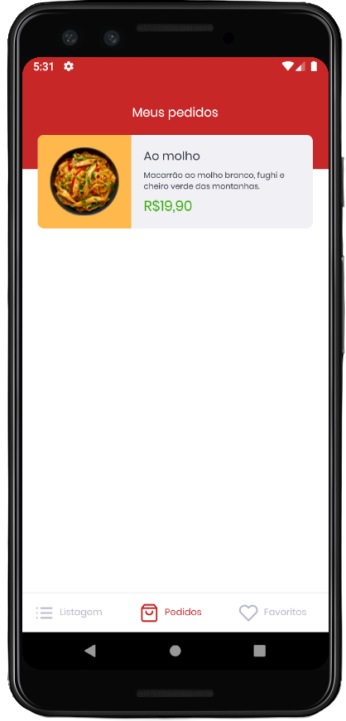

<h1 align="center">
  
</h1>

<h1 align="center">
  
  
</h1>

# Indice

- [Sobre](#-sobre)
- [Tecnologias utilizadas](#-tecnologias-utilizadas)
- [Utilizando uma Fake API](#-utilizando-uma-Fake-API)
- [Como baixar o projeto](#-como-baixar-o-projeto)
---

## 🧾Sobre

O Projeto **GoRestaurant** é sistema para delivery de um restaurante de comida Italiana. Na versão **Mobile** é possivel realizar pedidos ao restaurante e favoritas seus pratos favoritos assim como visualizar pedidos anteriores.

Projeto realizado durante o **Bootcamp GoStack** da Rocketseat.

---

## 🛠Tecnologias utilizadas

O Projeto foi desenvolvido utilizando as seguintes tecnologias

- React Native
- Axios
- Typescript
- Styled-components

---

## 🏴‍☠️ Utilizando uma Fake API
Para testar a aplicação você pode estar utilizando uma fake API, para isso no packge.json existe uma dependência chamada json-server, e um arquivo chamado server.json que contém os dados para as seguintes rotas:

**Rota** /foods: Retorna todas as comidas cadastradas na API

**Rota** /foods/:id: Retorna um prato de comida cadastradas na API baseado no id

**Rota** /categories: Retorna todas as categorias cadastradas na API

**Rota** /orders: Retorna todas os pedidos que foram cadastrados na API

**Rota** /favorites: Retorna todas as comidas favoritas que foram cadastrados na API

```bash
yarn json-server server.json -p 3333
```

---
## 💾 Como baixar o projeto

### Web

```bash

# Clonar o Repositório
$ git clone https://github.com/ArielCrivellaro/GoRestaurant-mobile

# Entrar no Repositório
$ cd GoRestaurant-Mobile

# Instalar as dependências
$ yarn install

# Iniciar o Projeto no Android
$ yarn android

# Iniciar o Projeto no IOS
$ yarn ios

```

### Versão Web

#### [GoRestaurant - Web](https://github.com/ArielCrivellaro/GoRestaurant-Web.git)

### 🚧 API Node
Em construção

---

### Desenvolvido por 😎 Ariel Crivellaro Martins
